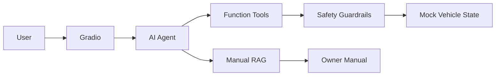

# AI Cockpit Agent

A fast, interview-ready AI application project for an intelligent cockpit scenario.

**Core stack:** LLM Agent + Function Calling + local manual RAG + deterministic safety guardrails + tests/eval.

## What it does

- Natural-language cockpit commands
- HVAC / seat heating / window / ambient light / navigation tools
- Local owner-manual retrieval for warning lights and usage questions
- Deterministic safety rule: block door opening while moving
- Mock vehicle state for a fully local, safe demo
- Gradio UI + pytest + lightweight eval script

## Architecture



## Quick start

```bash
python -m venv .venv
# Windows
.venv\\Scripts\\activate
# macOS/Linux
# source .venv/bin/activate

pip install -e ".[dev]"
copy .env.example .env   # Windows
# cp .env.example .env  # macOS/Linux
```

Edit `.env` and set your API key, then:

```bash
python -m cockpit_agent.ui
```

Run tests:

```bash
pytest -q
```

Run live eval:

```bash
python scripts/run_eval.py
```

## Demo prompts

- `我有点冷，把空调调到23度`
- `把主驾座椅加热调到2档`
- `胎压报警灯亮了是什么意思？`
- `导航到北京南站`
- `车辆正在行驶时帮我打开左前门`

## Project docs

- `docs/PRD.md` — MVP requirements
- `docs/ARCHITECTURE.md` — architecture
- `docs/SPRINT.md` — 7-day shipping plan
- `docs/DEMO_SCRIPT.md` — 90-second demo script
- `docs/RESUME.md` — resume bullets
- `docs/INTERVIEW.md` — interview talking points

## Scope

This is a simulated AI application project. It does **not** connect to or control a real vehicle.
