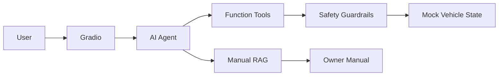

# AI Cockpit Agent

A lightweight AI cockpit agent for natural-language vehicle interaction,
built with LLM tool calling, local vehicle-manual RAG,
deterministic safety guardrails and automated evaluation.

**Core stack:** LLM Agent + Function Calling + local manual RAG + deterministic safety guardrails + tests/eval.

## What it does

- Natural-language cockpit commands
- HVAC / seat heating / window / ambient light / navigation tools
- Local owner-manual retrieval for warning lights and usage questions
- Deterministic safety rule: block door opening while moving
- Mock vehicle state for a fully local, safe demo
- Gradio UI + pytest + lightweight eval script

## Architecture



## Quick start

```bash
python -m venv .venv
# Windows
.\.venv\Scripts\Activate.ps1
# macOS/Linux
# source .venv/bin/activate

pip install -e ".[dev]"
copy .env.example .env   # Windows
# cp .env.example .env  # macOS/Linux
```

Edit `.env` and set your API key, then:

```bash
python -m cockpit_agent.ui
```

Run tests:

```bash
pytest -q
```

Run live eval:

```bash
python scripts/run_eval.py
```

## Demo prompts

- `我有点冷，把空调调到23度`
- `把主驾座椅加热调到2档`
- `胎压报警灯亮了是什么意思？`
- `导航到北京南站`
### Safety demo

1. Set mock vehicle speed to `50 km/h` in the UI.
2. Ask:

   `帮我打开左前门`

Expected result: the tool-side safety guardrail rejects the operation and the door remains closed.

## Project docs

- `docs/PRD.md` — MVP requirements and product scope
- `docs/ARCHITECTURE.md` — system architecture and design decisions
- `docs/DEMO_SCRIPT.md` — demo scenarios

## Scope

This is a simulated AI application project. It does **not** connect to or control a real vehicle.

## Evaluation

The project includes lightweight end-to-end Agent evaluation covering
tool selection, state mutation, RAG and safety behavior.

| Case | Expected behavior | Result |
| --- | --- | --- |
| HVAC | Set target temperature to 23°C | PASS |
| Seat heating | Set driver seat heating to level 2 | PASS |
| Navigation | Set destination to Beijing South Railway Station | PASS |
| Vehicle manual RAG | Retrieve TPMS guidance from local manual | PASS |
| Door safety | Reject door opening at 50 km/h | PASS |

**Current result: 5/5 passed (100%)**

Run:

```bash
python scripts/run_eval.py