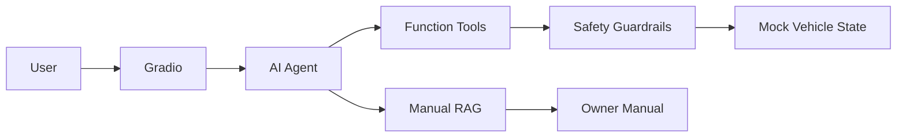

# AI Cockpit Agent

A lightweight AI cockpit agent for natural-language vehicle interaction,
built with LLM tool calling, local vehicle-manual RAG,
deterministic safety guardrails and automated evaluation.

**Core stack:** LLM Agent + Function Calling + local manual RAG + deterministic safety guardrails + tests/eval.

## What it does

- Natural-language cockpit commands
- HVAC / seat heating / window / ambient light / navigation tools
- Local owner-manual retrieval for warning lights and usage questions
- Deterministic safety rule: block door opening while moving
- Mock vehicle state for a fully local, safe demo
- Gradio UI + pytest + lightweight eval script

## Architecture


```mermaid
flowchart LR
    U[User] --> UI[Gradio]
    UI --> A[AI Agent]
    A --> T[Function Tools]
    A --> R[Manual RAG]
    T --> G[Safety Guardrails]
    G --> V[Mock Vehicle State]
    R --> M[Owner Manual]
```

## Quick start

```bash
python -m venv .venv
# Windows
.\.venv\Scripts\Activate.ps1
# macOS/Linux
# source .venv/bin/activate

pip install -e ".[dev]"
copy .env.example .env   # Windows
# cp .env.example .env  # macOS/Linux
```

Edit `.env` and set your API key, then:

```bash
python -m cockpit_agent.ui
```

页面包含 `Cockpit Demo` 与 `Knowledge Admin（只读）` Tab。后者按 Vehicle Profile 浏览本地资料的类型、版本、状态和相对来源路径，并只读取既有的 `outputs/release_gate/release_gate_summary.json`；报告不存在时显示 `NOT_RUN`（未运行），不会触发门禁、模型调用或任何内容修改。

`Evaluation Dashboard` Tab 只读取既有的 Retrieval、Answer 和 Release Gate JSON 摘要，展示评测指标、切片样本数、门禁、失败 Case ID 与 Baseline 对比；不会重新运行评测或调用模型。详见 `docs/EVALUATION_DASHBOARD.md`。

Cockpit Demo 的 Vehicle Profile 选择器将显式上下文传入 Vehicle Knowledge Tool，用于车型/版本相关问题；预发布 Profile 需要显式允许。回答保留精简来源引用和资料不足时的 Fallback。控制工具与 Mock Vehicle State 保持独立。详见 `docs/AGENT_VEHICLE_BOOK_INTEGRATION.md`。

Run tests:

```bash
pytest -q
```

Run live eval:

```bash
python scripts/run_eval.py
```

Run the local Vehicle Book Release Gate:

```powershell
python scripts\run_release_gate.py
```

本项目的 Release Gate 是本地模拟知识发布门禁，不等同于真实 OEM 内容审批或生产安全认证。

## Demo prompts

- `我有点冷，把空调调到23度`
- `把主驾座椅加热调到2档`
- `胎压报警灯亮了是什么意思？`
- `导航到北京南站`
### Safety demo

1. Set mock vehicle speed to `50 km/h` in the UI.
2. Ask:

   `帮我打开左前门`

Expected result: the tool-side safety guardrail rejects the operation and the door remains closed.

## Project docs

- `docs/PRD.md` — MVP requirements and product scope
- `docs/ARCHITECTURE.md` — system architecture and design decisions
- `docs/DEMO_SCRIPT.md` — demo scenarios
- `docs/KNOWLEDGE_ADMIN.md` — read-only knowledge administration view
- `docs/EVALUATION_DASHBOARD.md` — read-only evaluation dashboard
- `docs/AGENT_VEHICLE_BOOK_INTEGRATION.md` — controlled Vehicle Book Agent tool

## Scope

This is a simulated AI application project. It does **not** connect to or control a real vehicle.

## Evaluation

The project includes lightweight end-to-end Agent evaluation covering
tool selection, state mutation, RAG and safety behavior.

| Case | Expected behavior | Result |
| --- | --- | --- |
| HVAC | Set target temperature to 23°C | PASS |
| Seat heating | Set driver seat heating to level 2 | PASS |
| Navigation | Set destination to Beijing South Railway Station | PASS |
| Vehicle manual RAG | Retrieve TPMS guidance from local manual | PASS |
| Door safety | Reject door opening at 50 km/h | PASS |

**Current result: 5/5 passed (100%)**

Run:

```bash
python scripts/run_eval.py
