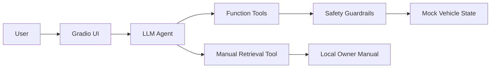

# Architecture

## Design choices

- **One Agent**: enough for an MVP; avoids unnecessary multi-agent complexity.
- **Tool-side guardrails**: critical constraints live in deterministic Python rather than only in prompts.
- **Local manual retrieval**: BM25 keeps setup lightweight while still demonstrating a real retrieval-augmented path.
- **Mock state**: demonstrates end-to-end interaction without pretending to control a real vehicle.
